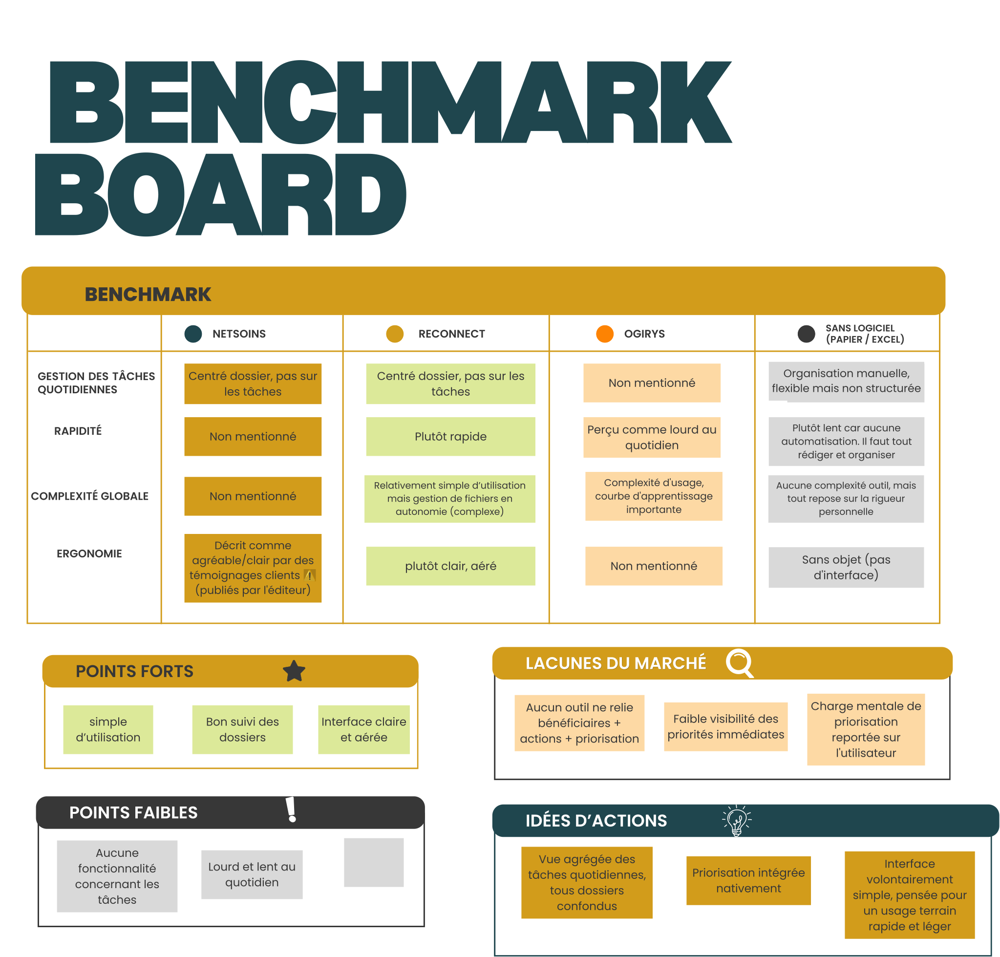

# Benchmark des outils de suivi social et médico-social

## Objectif

Analyser les solutions existantes utilisées en structures sociales afin d'identifier :

- leur capacité à structurer les actions quotidiennes
- leur niveau de complexité en situation réelle
- l'écart entre promesse produit et usage terrain

---

## 1. Outils spécialisés du secteur social

### NetSoins (Logiciel)

**Positionnement**
Solution de suivi des soins et de coordination des équipes en établissement.

**Points forts**
- Bon suivi des dossiers et des transmissions
- Adapté au travail pluridisciplinaire
- Décrit comme agréable et clair par des témoignages clients ⚠️ (publiés par l'éditeur, source non indépendante)

**Limites terrain**
- Centré sur le dossier plutôt que sur les actions quotidiennes
- Faible visibilité des priorités individuelles
- Charge mentale toujours portée par l'utilisateur

**Synthèse**
Outil efficace pour documenter, mais limité pour organiser le travail quotidien.

---

### OGiRYS (Logiciel)

**Positionnement**
ERP complet pour la gestion globale des établissements sociaux et médico-sociaux.

**Points forts**
- Couverture fonctionnelle très large
- Gestion organisationnelle globale (RH, planning, administratif)
- Adapté aux structures complexes

**Limites terrain**
- Perçu comme lourd et lent au quotidien (confirmé par avis indépendant vérifié, note 2/5 — lebonlogiciel.com)
- Complexité d'usage, courbe d'apprentissage importante
- Difficile à appréhender pour les équipes terrain

**Synthèse**
Solution puissante mais difficile à exploiter dans un usage opérationnel rapide.

---

### Reconnect (Logiciel)

**Positionnement**
Outil numérique de gestion documentaire, testé personnellement en tant qu'éducatrice spécialisée.

**Points forts**
- Interface claire et aérée
- Plutôt rapide à l'usage
- Relativement simple d'utilisation

**Limites terrain**
- Aucune fonctionnalité concernant les tâches ou la priorisation
- Organisation des dossiers et fichiers entièrement à la charge de l'utilisateur (création, classement, catégorisation)
- Sans structure imposée, l'absence de rigueur personnelle mène rapidement au désordre

**Synthèse**
Un outil agréable visuellement, mais qui ne répond pas au besoin de gestion des tâches quotidiennes et reporte toute la charge d'organisation sur l'utilisateur.

---

## 2. Méthode sans logiciel

### Papier / Excel

**Usage**
Méthode utilisée avant l'adoption d'un logiciel métier : dossiers papier et fichiers Excel de contournement pour la gestion des tâches.

**Points forts**
- Simple d'utilisation, aucune courbe d'apprentissage
- Grande flexibilité (Excel)
- Aucune complexité outil : tout repose sur la rigueur personnelle

**Limites terrain**
- Plutôt lent : aucune automatisation, tout doit être rédigé et organisé manuellement
- Aucune intégration avec les dossiers bénéficiaires
- Risque de perte ou de désorganisation des données

**Synthèse**
Solution de contournement plutôt qu'outil métier — fonctionne uniquement grâce à la rigueur individuelle, sans aucun gain de temps.

---

> Reconnect et « Sans logiciel » évalués sur retour d'expérience personnel (usage terrain en tant qu'éducatrice).

---

## 3. Synthèse comparative

---

## Conclusion

Trois catégories de solutions coexistent :

**Outils métiers** 
- Structurent les dossiers
- Centralisent les informations
- Mais ne facilitent pas la priorisation quotidienne
- Interface agréable
- Mais aucune fonctionnalité tâches, organisation reportée sur l'utilisateur

**Méthode manuelle** (papier / Excel)
- Flexible mais complexe car prend beaucoup de temps de rédaction
- Non structurée, sans intégration bénéficiaire

---

## Insight clé

Aucune solution actuelle ne relie simplement :

- les bénéficiaires
- les actions à réaliser
- la priorisation immédiate du travail quotidien

---

## Opportunité

Un espace produit clair existe autour de la centralisation des actions quotidiennes liées aux bénéficiaires, avec une logique de priorité intégrée.