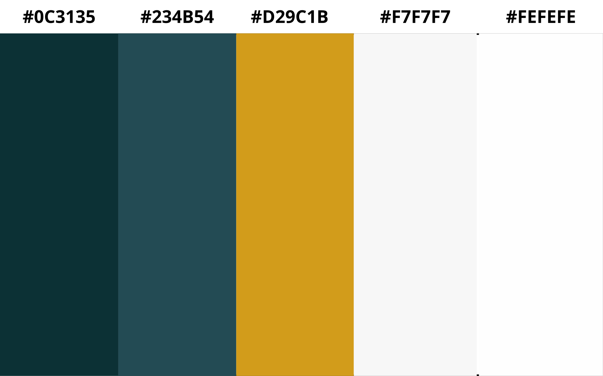

# DESIGN.md : Charte graphique Oriaa

## Identité visuelle

**Slogan principal :** *"Pour que l'accompagnement reste au centre."*

**Slogan secondaire :** *"Pensé par le terrain, pour l'essentiel."*

## Design tokens

### Couleurs

| Token | Valeur | Rôle | Usage |
|---|---|---|---|
| `--color-bg-page` | `#F7F7F7` | Fond principal de page | Écrans dashboard, arrière-plan global |
| `--color-bg-surface` | `#FEFEFE` | Cartes / surfaces / modales | Cards, tableaux, conteneurs, modales, dropdowns |
| `--color-structure` | `#0c3135` | Couleur forte de structure | Sidebar, header tableau, éléments fixes (navigation, blocs principaux), icônes importantes |
| `--color-interaction` | `#234b54` | Interaction et hiérarchie secondaire | Hover sidebar, liens, états actifs secondaires, texte important (titres, labels forts) |
| `--color-accent` | `#D29C1B` | Couleur de décision / action | Boutons principaux, validation, highlight fort, badges importants |

### Typographie

| Token | Valeur | Usage |
|---|---|---|
| `--font-title` | `'Outfit', sans-serif` | Titres, en-têtes |
| `--font-body` | `'Inter', sans-serif` | Corps de texte, formulaires |

### Iconographie

- Bibliothèque : [Lucide](https://lucide.dev)
- Style : trait fin, cohérent avec la sobriété visuelle recherchée

### Espacements (à affiner éventuellement))

| Token | Valeur |
|---|---|
| `--spacing-sm` | 8px |
| `--spacing-md` | 16px |
| `--spacing-lg` | 24px |

## Accessibilité (RGAA 4.1)

### Contrastes couleur/fond (calculés selon formule WCAG 2.1 (https://coolors.co/contrast-checker))

| Paire | Ratio | AA texte normal (4.5:1) | AAA (7:1) |
|---|---|---|---|
| `#0c3135` sur `#F7F7F7` | 13.01 | ✅ | ✅ |
| `#0c3135` sur `#FEFEFE` | 13.82 | ✅ | ✅ |
| `#234b54` sur `#F7F7F7` | 8.89 | ✅ | ✅ |
| `#234b54` sur `#FEFEFE` | 9.44 | ✅ | ✅ |
| Blanc sur `#0c3135` (texte sidebar) | 13.94 | ✅ | ✅ |
| Blanc sur `#234b54` (hover sidebar) | 9.52 | ✅ | ✅ |
| `#0c3135` sur `#D29C1B` (texte sur bouton accent) | 5.65 | ✅ | ❌ |

### Autres exigences

- Navigation clavier prévue sur tous les parcours principaux
- Alternatives textuelles systématiques sur les éléments visuels informatifs

## Maquettes

Wireframes et maquettes haute fidélité réalisés sur Figma :
🔗 [Lien Figma à insérer]

Prototype interactif cliquable (parcours utilisateur principal) :
🔗 [Lien Figma prototype à insérer]